# Apa itu Laravel

Laravel adalah sebuah framework aplikasi web berbasis PHP yang dirancang untuk memudahkan proses pengembangan aplikasi web dengan cara yang lebih elegan dan ekspresif. Framework ini diciptakan oleh Taylor Otwell dan pertama kali dirilis pada tahun 2011.Laravel hadir sebagai platform web development yang bersifat _open source_. Yang menarik dari Laravel adalah sintaksnya yang ekspresif dan elegan yang dirancang khusus untuk memudahkan dan mempercepat proses web development.

Dengan Laravel, tugas-tugas umum developer dapat dikurangi pada sebagian besar proyek-proyek web seperti _routing_, _session_ dan _caching_. Disamping itu, laravel berusaha menggabungkan pengalaman-pengalaman development dalam bahasa lain, seperti Ruby on Rails, ASP.NET, MVC dan Sinatra.

# Kenapa Memakai Laravel

Sesuai dengan motto laravel itu sendiri “**PHP doesn’t hurt, code happy & enjoy the fresh air**”. Tujuan utama dari laravel adalah mempermudah _coding_ dalam membuat sebuah produk web. Bahkan laravel termasuk dalam best php framework 2014 versi webdesignmoo dan yang paling banyak digunakan oleh developer. Ini membuktikan bahwa menggunakan Laravel memang dapat mempercepat dan mempermudah _development_ website.

# Memulai Laravel (Instalasi dan Konfigurasi)

## Requirement

Laravel sangatlah mudah untuk dikonfigurasi untuk mengembangkan sebuah projek. Pada bagian ini, saya akan menjelaskan *software/tools* apa saja yang diperlukan, proses instalasi dan proses konfigurasinya.

Adapun kebutuhan yang harus disediakan diantaranya :

### Text Editor

Pilih text editor yang sesuai dengan kebutuhan atau selera Anda. Disini saya menggunakan text editor Visual Studio Code. Anda bisa juga menggunakan PHPStorm, Aptana, Netbeans, Notepad++ dan lain-lain.Berikut adalah langkah-langkah penginstalan text editor yang saya gunakan (Visual studio code) :

- Kunjugi situs resmi visual studio code : [https://code.visualstudio.com/download](https://code.visualstudio.com/download)
- Klik versi yang kalian butuhkan, terdapat tiga yang bisa dijalankan di desktop yaitu Windows, Linux, dan Macbook
- Buka folder VSCode yang sudah di download
- Klik dua kali folder tersebut, Setelah itu akan ada noted Setup - Microsoft Visual Studio Code (User) License Agreement atau perjanjian lisensi yang bahwasanya setuju menginstall VSCode dengan persyaratan yang telah ditentukan
- l Klik “I accept the agreement” lalu klik next
- 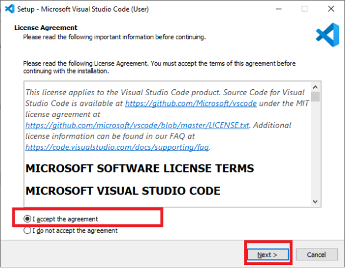
- Selanjutnya akan ada Select Destination Location atau memilih lokasi tujuan. Jadi folder tersebut akan diletakkan di mana
- 
- Klik 'Next' pada tahap ini
- 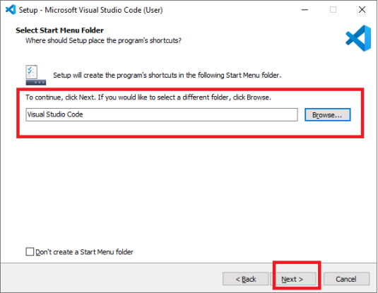
- Pilih optional secara default, kemudian klik 'Next'
- 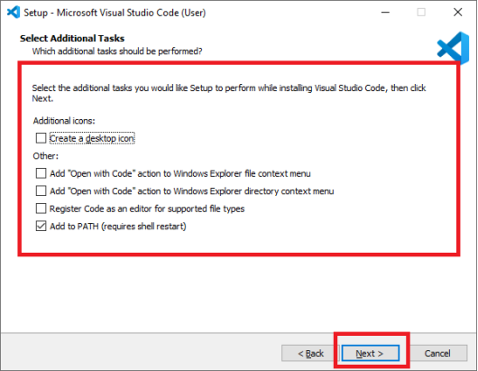
- Klik '_Install_'
- 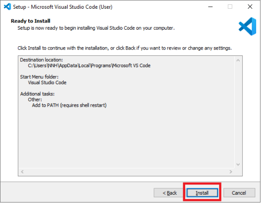
- Tunggu proses instalasi hingga selesai.
- 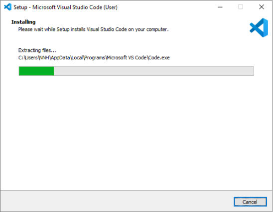
- Centang 'Launch Visual Studio Code' jika anda ingin langsung membuka aplikasinya, kemudian klik 'Finish'.
- 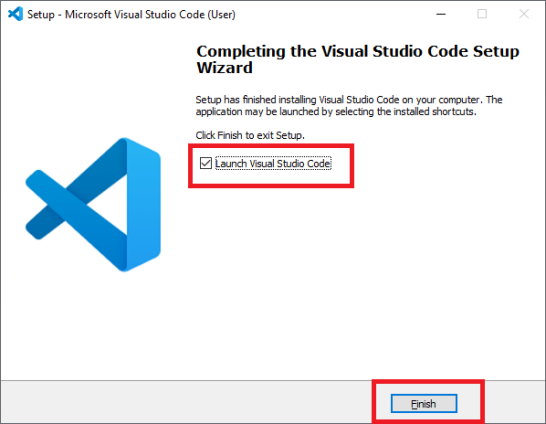

### Webserver dan Database

Yang terpenting dalam instalasi Laravel yaitu bahwa versi PHP minimal versi >= 5.4 dan Sekarang Laravel telah mencapai versi 11. Pastikan Anda memiliki PHP versi 8.1 atau yang lebih baru untuk dapat menggunakan Laravel versi terbaru.

Sebagai contoh, jika Anda menggunakan XAMPP, pastikan versi XAMPP yang Anda gunakan mendukung PHP 8.1 atau Anda dapat menginstal PHP versi 8.1 secara terpisah.

Berikut Langkah-langkah Instalasi XAMPP :

1. Buka situs resmi dari _software_ XAMPP : [https://www.apachefriends.org/download.html](https://www.apachefriends.org/download.html)
2. Pilih sesuai dengan sistem operasi yang anda gunakan. Di situs tersebut tersedia 3 sistem operasi yang mendukung XAMPP diantaranya windows, linux dan OS X
3. Dalam hal ini karena komputer saya menggunakan sistem operasi Windows, maka saya akan pilih versi XAMPP for windows
4. 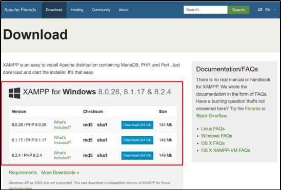
5. Tekan tombol download pada salah satu versi yang dapat kalian pilih. disini saya memilih versi 8.1.17. Karena komputer saya menggunakan sistem operasi 64 bit maka muncul tombol download (64-bit) sementara jika sistem operasi windows kalian versi 32 bit silahkan disesuaikan.
6. Buka folder Xampp yang sudah di download, Kemudian klik kanan dan run as administrator
7. Selanjutnya klik ‘Next’
8. 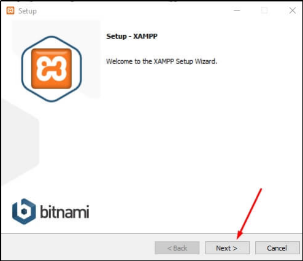
9. Pada tahapan ini, Anda akan diminta untuk memilih aplikasi yang mau diinstal. Centang saja semua pilihan dan klik tombol Next.
10. 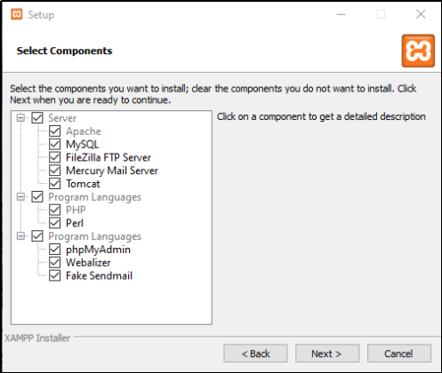
11. Pilih folder instalasi XAMPP. Saya sarankan pilih default saja yaitu di C:/xampp, namun jika ingin menyimpannya di partisi lain juga tidak masalah. Lalu Klik Next
12. 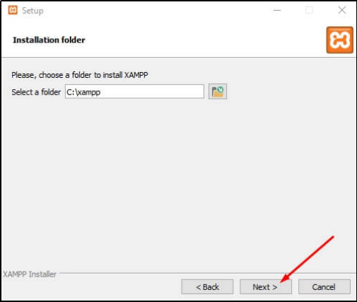
13. Pilih bahasa English saja, lalu Klik Next
14. 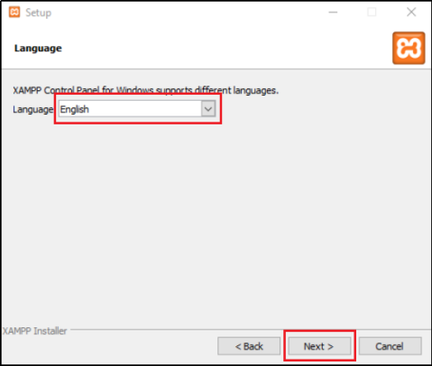
15. Tunggu hingga proses install XAMPP selesai
16. 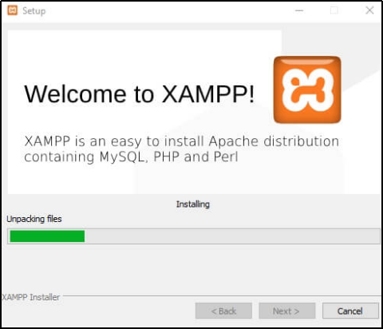
17. Jika sudah muncul jendela seperti di bawah ini, klik tombol Finish untuk menyelesaikannya.Selain itu, akan muncul opsi apakah Anda mau langsung menjalankan aplikasi XAMPP atau tidak. Jika ya, maka centang opsi tersebut.
18. 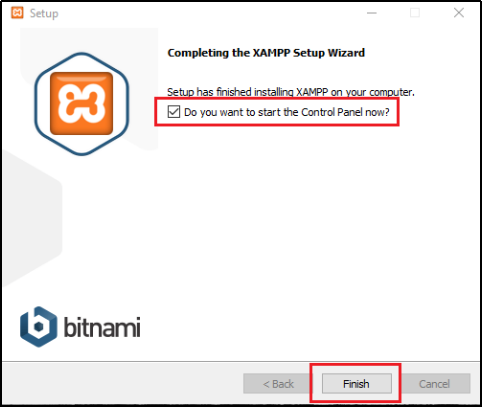
19. Bukalah aplikasi XAMPP, bisa melalui Start Menu atau Desktop, dan klik icon XAMPP.
20. 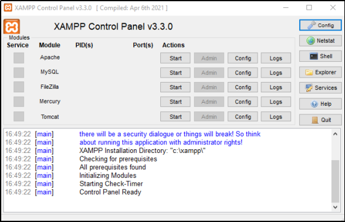
21. Setelah terbuka, silahkan klik tombol Start pada kolom Action sehingga tombol tersebut berubah menjadi Stop. Dengan mengklik tombol tersebut, artinya itulah aplikasi yang dijalankan. Biasanya jika saya menggunakan XAMPP, yang saya start hanyalah aplikasi Apache dan MySQL, karena saya tidak memerlukan aplikasi seperti Filezilla, dan lain-lain.
22. 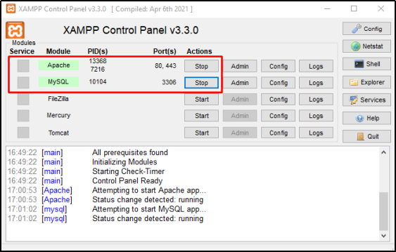
23. Sekarang bukalah browser kesukaan Anda, dan coba ketikkan "**localhost**" di address bar. Jika muncul tampilan seperti gambar di bawah ini, instalasi telah berhasil.
24. 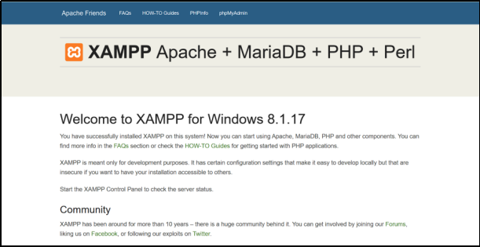

### Composer

Untuk dapat menginstal laravel kita akan menggunakan composer. Composer adalah package manager untuk PHP yang mengelola dependensi dalam proyek secara efisien, termasuk dalam proyek Laravel.. Adapun proses instalasi composer adalah sebagai berikut :

1. Unduh composer di : [https://getcomposer.org/Composer-Setup.exe](https://getcomposer.org/Composer-Setup.exe)
2. 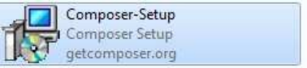
3. Setelah file installer berhasil didownload, lakukan penginstallan dengan cara double klik file installer composer.
4. 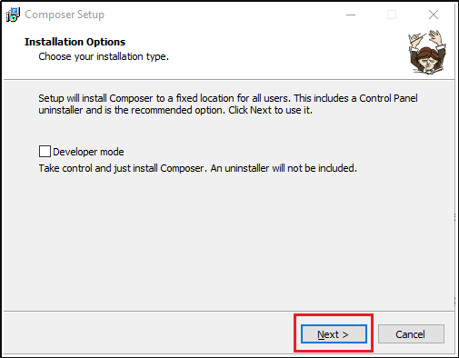
5. Tentukan folder installer untuk composer di komputer, biasanya di C:\Composer.
6. 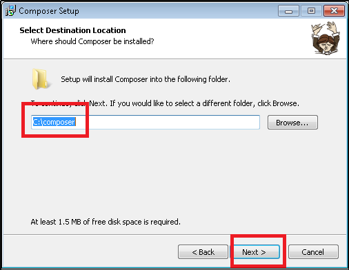
7. Kemudian pilih lokasi PHP yang sudah terinstall. Jika Anda menggunakan XAMPP, lokasi file ini akan berada di  C:\xampp\php\php.exe. Klik Next.
8. 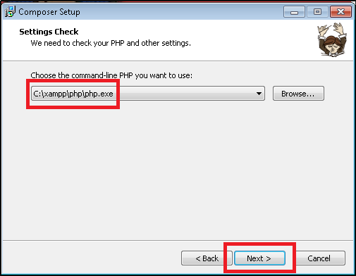
9. Kemudian Anda akan diminta untuk memilih, apakah Anda akan menggunakan proxy atau tidak. Jika Anda ingin menggunakan proxy, klik centang dan masukkan URL proxy Anda. Apabila Anda tidak ingin menggunakan proxy, langsung klik Next untuk melanjutkan instalasi.
10. 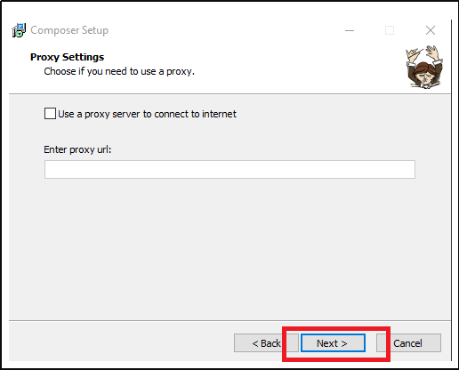
11. Selanjutnya pastikan kalau proses instalasi berjalan di lokasi file yang seharusnya, yaitu C:\xampp\php\php.exe. Jika sudah benar, klik Install.
12. 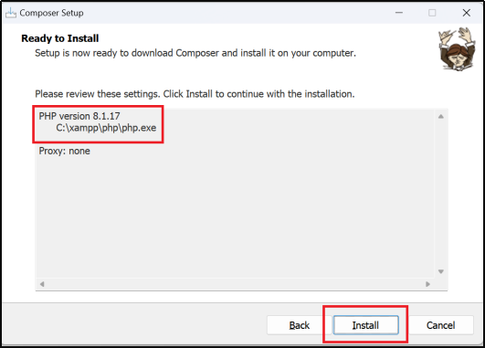
13. Berikutnya adalah tampilan pemberitahuan bahwa telah terjadi perubahan pada Windows environment. Perubahan ini dimaksudkan agar Composer dapat dijalankan pada Command Prompt. Klik Next.
14. 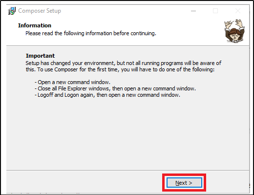
15. Proses instalasi selesai, klik Finish untuk menutup jendela instalasi Composer.
16. 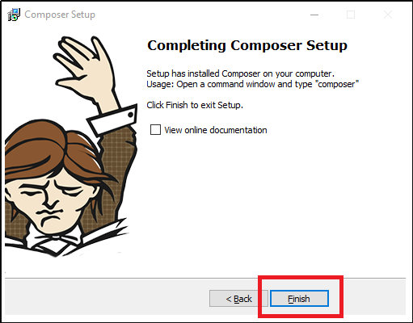
17. Untuk mengecek apakah composer berhasil di install, lakukan langkah-langkah berikut. Silahkan masuk ke terminal atau klik windows+R,kemudian ketikkan cmd kemudian Enter. Kemudian masukkan perintah composer. Jika composer berhasil diinstall akan muncul tampilan seperti gambar berikut.
18. 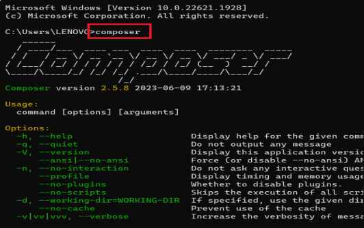

## Install Package Laravel

1. Untuk mengunduh paket laravel dapat menggunakan yaitu :mendownload langsung menggunakan composer langsung.
2. Buka Command Prompt kemudian arahkan direktori ke htdoc XAMMP yang sudah di instal. kemudian ketikan sintak berikut :

```bash
composer create-project laravel/laravel coba-laravel
```

3. Tunggu sampai proses unduh berhasil.
4. 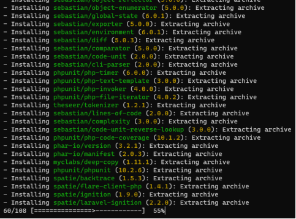
5. Jika proses unduh telah selesai, kemudian buka folder yang tadi sudah di download dengan mengetikkan cd {nama folder} contoh yang sudah dibuat “cd coba-laravel”
6. 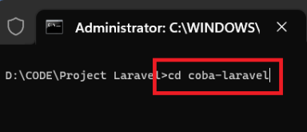
7. Untuk mengecek apakah laravel sudah terinstal yaitu dengan cara jalankan perintah php artisan serve untuk menjalankan sebagai server. Secara default url nya adalah http://localhost:8000. Untuk mengubah port tinggal menjalankan perintah php artisan serve --port={port}. Kalian bisa ubah {port} sesuai keinginan kalian.
8. 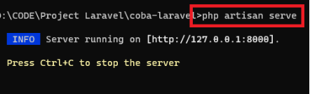
9. Buka browser kemudian ketik localhost:8000. Jika tampilan sebagai berikut, berarti laravel yang diinstal sudah berjalan.
10. 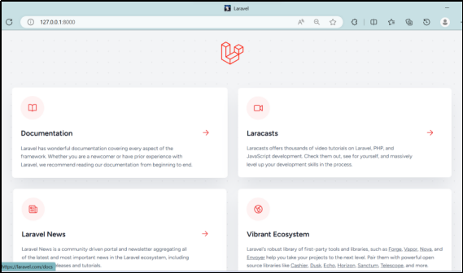

## Struktur Projek Laravel

Jika kita buka folder laravel tersebut maka kita akan menemukan folder-folder dan file sebagai berikut :

- `app/`
- `bootstrap/`
- `config/`
- `database/`
- `public/`
- `resources/`
- `routes/`
- `storage/`
- `test/`
- `vendor/`
- `.editorconfig`
- `.env`
- `.env.example`
- `.gitattributes`
- `.gitignore`
- `artisan`
- `composer.json`
- `composer.lock`
- `package.json`
- `phpunit.xml`
- `README.md`
- `vite.config.js`

berikut adalah penjelasan struktur-struktur projek laravel diatas .

### App/

Folder app berisi kode-kode inti dari aplikasi seperti Model, Controller, Commands,
Listener, Events, dll. Poinnya, hampir semua class dari aplikasi berada di folder ini.

### Bootstrap/

Folder ini berisi berbagai file yang bertanggung jawab untuk menginisialisasi lingkungan
aplikasi dan mengatur konfigurasi awal sebelum aplikasi Laravel benar-benar dijalankan.
yang digunakan untuk meningkatkan kinerja aplikasi.

### Config/

Folder config seperti namanya, berisi semua file konfigurasi aplikasi Anda.

### Database/

Folder database berisi database migrations, model factories, dan seeds. Folder ini akan
bertanggung jawab dengan pembuatan dan pengisian tabel-tabel database.

### Public/

Folder public memiliki file index.php yaitu entry point dari semua requests yang
masuk/diterima ke aplikasi. Folder ini juga tempat menampung gambar, Javascript, dan
CSS.

### Resources/

Folder resources berisi semua route yang disediakan aplikasi. Sebagai default, beberapa file
routing akan tersedia seperti: web.php, api.php, console.php, dan channels.php. Folder ini
adalah tempat dimana kita memberikan koleksi definisi route aplikasi.

### Routes/

folder "routes" berfungsi sebagai tempat untuk mendefinisikan berbagai rute (routes) atau
aturan yang menentukan bagaimana aplikasi akan merespons permintaan HTTP yang
masuk. Rute menentukan tindakan apa yang harus diambil oleh aplikasi ketika permintaan
diterima dari URL tertentu.

### Storage/

Folder storage adalah tempat dimana cache, logs, dan file sistem yang ter-compile hidup.

### Test/

Folder tests adalah tempat dimana unit dan integration tests tinggal.

### Vendor/, Folder "vendor" berisi dependensi pihak ketiga yang diinstal melalui komposer (Composer).

### .editorconfig

Berguna untuk memberi IDE/text editor instruksi tentang standar coding Laravel seperti
whitespace, besar identasi, dll.

### .env & .env.example

Tempat dimana variable environment aplikasi ditempatkan (variabel yang diekspektasikan
akan berbeda di setiap sistem) seperti nama database, username database, password
database.

### .gitattributes & .gitignore

File konfigurasi git.

### Artisan

Memungkinkan anda untuk menjalankan perintah artisan dari command line.

### Composer.json & Composer.lock

File konfigurasi untuk composer. File ini adalah informasi dasar tentang projek dan juga
mendefinisikan dependencies yang digunakan.

### Package.json

Mirip-mirip dengan composer.json tapi untuk aset-aset dan dependencies front-end.

### Phpunit.xml

Sebuah file konfigurasi untuk PHPUnit, tools yang digunakan Laravel untuk testing.

### README.md

Sebuah markdown file yang memberikan pengenalan dasar tentang Laravel.

# Mengenal Dasar Routing

## Routing Dasar

Hal pertama yang akan kita pelajari yaitu tentang laravel pada materi ini adalah tentang routing, apa itu Routing ?

Sebelum beranjak ke materi yang detail tentang routing akan saya coba beri analogi tentang routing ini. Bayangkan jika anda sedang akan login ke facebook, hal pertama yang harus anda lakukan adalah menuliskan url facebook di web browser kemudian enter dan hasilnya akan muncul homepage login facebook. Jika anda mencari sesuatu di google, Anda menulis kata yang dicari di beranda Google kemudian google akan menampilkan hasil dari yang anda cari.

Nah dari analogi diatas, routing digunakan untuk meng-handle request yang kita berikan ke aplikasi web. Bisa jadi routing adalah jembatan yang menghubungkan kita dengan respon yang akan diberikan oleh web aplilkasi. Jadi setiap ada permintaan (request) terhadap alamat tertentu, maka akan alamat akan dieksekusi terlebih dahulu dalam routing sebelum akhirnya akan menampilkan hasil (response).

Jika masih bingung tentang routing, akan kita coba langsung di dalam laravel ini.

Buka folder laravel yang telah di instal dengan text editor Anda, kemudian buka file `web.php` di folder `routes/web.php` .Berikut adalah isian dari `routes/web.php`.

**`routes/web.php`**

```php
Route::get('/', function(){
	return view("welcome");
})
```

Ganti respon route diatas menjadi

**`routes/web.php`**

```php
Route::get('/', function(){
	return 'Halo bang Laravel';
})
```

Kemudian buka web browser dan ketikan alamat localhost:8000, kemudian hasilnya seperti gambar dibawah ini.
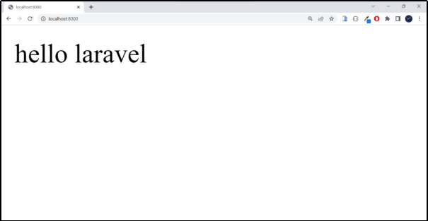
Gambar diatas adalah hasil (response) dari route yang telah kita manipulasi tadi. Kemudian kita akan coba membuat route baru dengan mengetikan sintak sebagai berikut.

**`routes/web.php`**

```php
Route::get('/book', function(){
	return 'ini adalah book dari laravel';
});
```

Route diatas akan menghasilkan hasil sebagai berikut :
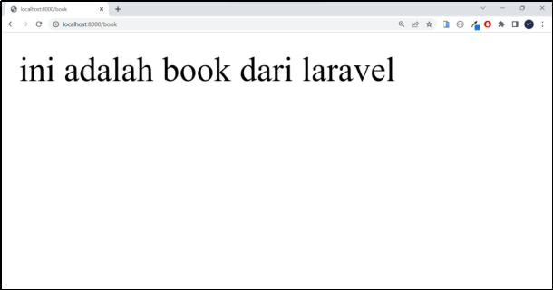
Routes selalu dideklarasikan menggunakan kelas Routes dan salah satu method yang dipakai untuk request sebuah halaman webpage yaitu GET menggunakan HTTP. GET request ini dikirim setiap waktu ketika kita mengetikan sebuah alamat web di web browser.

Disamping method GET, ada juga method POST yang digunakan untuk membuat sebuah permitaan (request) dan menyediakan sebuah data yang relatif kecil. Normalnya method ini digunakan sebagai sebuah hasil submit dari form dimana data akan dikirimkan ke database tanpa ditampilkan ke URL.

Ada banyak method yang disediakan oleh kelas routes khususnya untuk restful, diantaranya.

- Route::get();
- Route::post();
- Route::put();
- Route::delete();
- Route::any();

Kita akan mempelajari method route tersebut di depan khususnya dengan yang berkaitan dengan RESTful routing pada saat proses CRUD (Create, Read, Update dan Delete)

## Routing Berparameter

Route berparameter ini dapat digunakan untuk menempatkan sebuah nilai ke route atau URL yang digunakan untuk berbagai keperluan yang dibutuhkan nantinya.

Langsung kita coba, buka file web.php kemudian ketikan Route baru berikut ini.

**`routes/web.php`**

```php
Route::get('/motor', function(){
	return 'dashboard motor';
});
```

Route diatas akan menghasilkan hasil sebagai berikut :
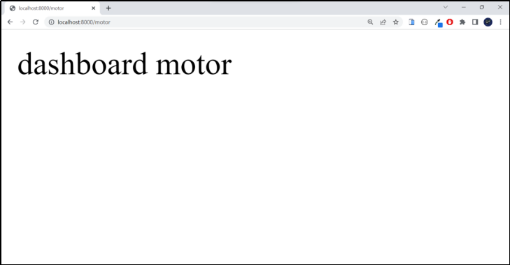
Masih di routes yang sama, kemudian kita akan membuat satu route yang mempunyai parameter yang berfungsi untuk mengirimkan sebuah nilai untuk ditampilkan ke web browser.

**`routes/web.php`**

```php
Route::get('/motor/{jenis}', function($jenis){
	return 'motor dengan jenis : ' . $jenis;
});
```

Kemudian kita ketik URL di browser dan berikan nilai “Kawasaki” untuk route yang berparameter , localhost/motor/kawasaki dan hasilnya adalah sebagai berikut.
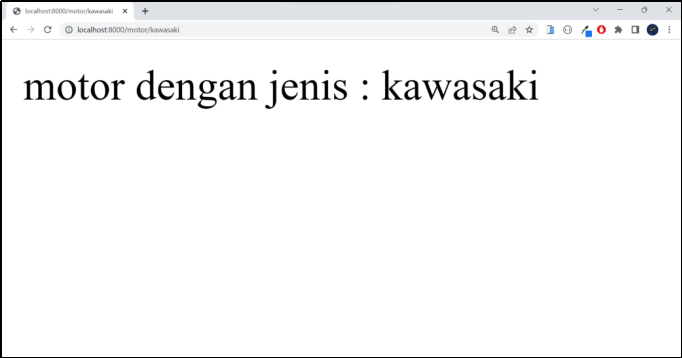
Kamu dapat mencoba dengan berbagai nilai untuk diberikan ke route diatas seperti:

- localhost:8000/motor/ninja
- localhost:8000/motor/nmax
- localhost:8000/motor/moge

Dalam contoh diatas, kita mengirimkan sebuah nilai yaitu “Kawasaki” pada route berparameter motor/{jenis} dan dalam function route tersebut kita deklarasikan variabel $jenis untuk ditampilkan pada saat response.

Sebuah parameter juga dapat dijadikan sebuah pilihan jika parameter tersebut tidak diisi (null) atau diberi nilai default maka dapat ditambahkan sebuah tanya tanya (?)

**`routes/web.php`**

```php
Route::get('/motor/{jenis?}', function($jenis = null){
	if($jenis == null) return "dashboard motor";
	return 'motor dengan jenis : ' . $jenis;
});
```

Jika route diatas ada fungsi logika nya yaitu jika nilai $jenis = null (kita tidak memberikan nilai di URL) maka akan mengemballikan "Motor Dashboard Page";.Tapi jika variabel $jenis kita beri nilai maka akan mengembalikan "Motor dengan jenis ".<nilai_variabel>;. Kita dapat lihat pada contoh sebagai berikut.
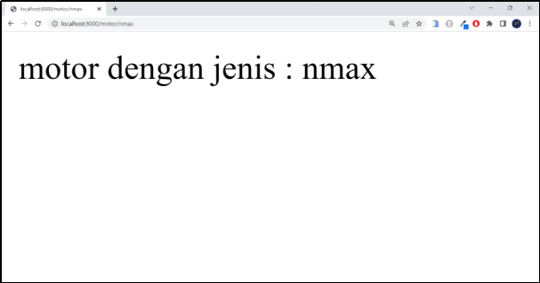
Tapi kalau kita biarkan atau kita tidak mengisikan nilai “nmax” untuk URL diatas, maka hasilnya adalah sebagai berikut :
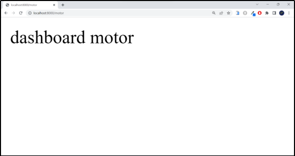
Disamping nilai default (null), kita juga dapat memberikan nilai sesuai dengan kebutuhan. Misalkan kita beri contoh default untuk variabel $jenis = "Sport", maka route nya seperti ini

**`routes/web.php`**

```php
Route::get('/motor/{jenis?}', function($jenis = "Sport"){
	return 'motor dengan jenis : ' . $jenis;
});
```

Route diatas apabila kita eksekusi dengan tidak memberikan nilai di URL nya maka akan mengembalikan response dengan nilai "**Motor dengan jenis Sport** ". Tapi kalau kita memberikan nilai di URLnya misalkan “**Bebek**”, maka hasil responnya adalah sebagai berikut "**Motor dengan jenis Bebek**".

# Mengenal MVC (Model-View-Controller)

MVC atau kepanjangan dari Model-View-Controller adalah sebuah metode yang digunakan dalam pengembangan suatu aplikasi yang memisahkan data (model) dari tampilan / frontend (View) dan logic dari aplikasi itu sendiri (Controller). MVC memisahkan pengembangan aplikasi berdasarkan komponen utama yang membangun sebuah aplikasi seperti manipulasi data, antarmuka pengguna dan kontrol dalam sebuah aplikasi.

Model digunakan untuk proses query atau manipulasi data ke/dari database. Sedangkan View kaitannya erat dengan antarmuka / frontend tampilan sebuah web seperti HTML, CSS dan JS dan data yang bersifat client. Controller adalah logika dari sebuah web. Menjembatani komunikasi antara Model dan View. Kalau digambarkan alur proses MVC adalah sebagai berikut :
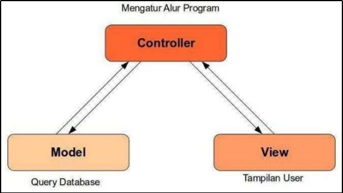
Adapun gambar simulasi proses MVC pada Laravel diperlihatkan pada gambar dibawah ini.
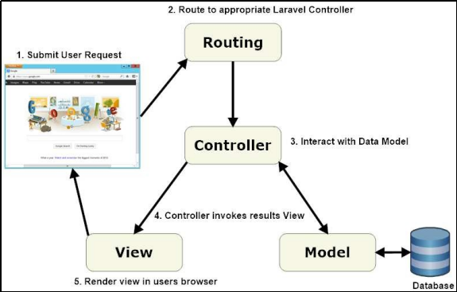
Untuk lebih jelasnya kita langsung praktikan proses MVC pada laravel. Pertama kita membuat sebuah controller dengan nama BookController. Disini saya menggunakan composer untuk membuat kontroller. Dengan sintak sebagai berikut :

```bash
php artisan make:controller BookController
```

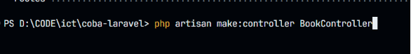

Setelah itu **BookController** isi sebagai berikut :

**`App/Http/Controllers/BookController.php`**

```php
<?php
class BookController extends Controller {
	public function index(){
		return 'ini adalah bookcontroller';
	}
}
```

Setelah membuat controller, kemudian kita buka file web.php. Buat sebuah route yang merujuk pada kontroller yang telah dibuat diatas.

**`routes/web.php`**

```php
Route::get('/book', [BookController::class, 'index']);
```

Penjelasan route diatas adalah Route menggunakan method **get** untuk menampilkan _response_ dari method **index** dari kontroller **BookController**. Untuk melihat output dari proses diatas ketikan URL sebagai berikut localhost:8000/book . Adapun hasilnya seperti gambar dibawah ini.
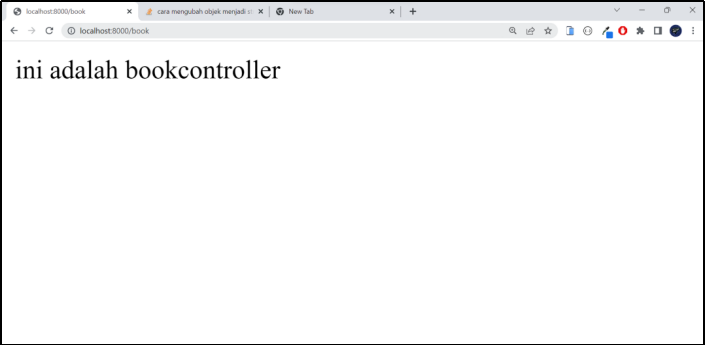
Kita akan coba bagaimana mengirimkan sebuah parameter / nilai dari route ke kontroller. Ganti
route user kemudian tambahkan parameter “judul”.

**`routes/web.php`**

```php
Route::get('/book/{judul}',[BookController::class,'viewJudul']);
```

Lalu kita buat satu buah method viewJudul di BookController

**`App/Http/Controllers/BookController.php`**

```php
<?php
class BookController extends Controller {
	public function viewJudul($judul){
		return 'buku yang telah anda baca : ' . $judul;
	}
}
```

Kemudian cek kode diatas dengan mengetikan URL sebagai berikut pada web browser
localhost:8000/book/chainsaw-man
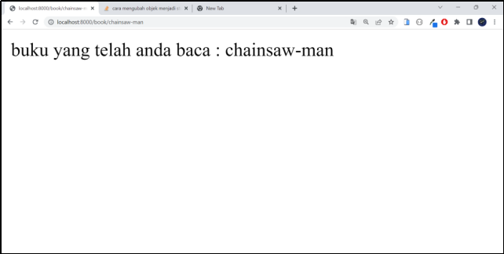
Setelah itu, kita akan coba mengintegrasikan Controller dengan View.Pada folder **resources/views/** kemudian buat sebuah file PHP dengan nama **v_book.blade.php** dan isikan kode sebagai berikut.

**`resources/views/v_book.blade.php`**

```html
<h1>Page view</h1>
<p>Buku yang telah anda baca berjudul <h1>{{ $judul }}</h1></p>
```

Buka kontroller **BookController** kemudian edit method **viewJudul** dan isikan kode sebagai berikut.

**`app/Http/Controllers/BookController.php`**

```php
<?php
class BookController extends Controller {
	public function viewJudul($judul){
		return view('v_book',compact('judul'));
	}
}
```

Method viewJudul diatas akan mengeksekusi view v_book.blade.php pada folder resources/view. Dan kalau kita jalankan di web browser dengan mengetikan URL sebagai berikut localhost:8000/book/chainsaw-man hasilnya adalah sebagai berikut.
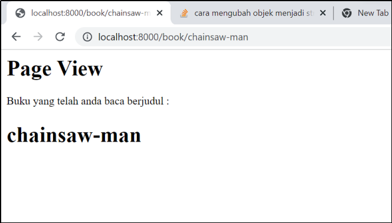

# Mengenal Blade Template Engine Laravel

Template engine adalah sebuah method untuk mempersingkat penulisan kode yang lebih panjang contoh nya yaitu smartt, twigg dan doo. Sedangkan blade itu sendiri adalah template engine bawaan laravel. Blade menawarkan penulisan kode/sintax yang mudah dan singkat untuk dipakai dalam menghasilkan kode HTML.

Pada bagian View inilah fungsi Blade sangat dibutuhkan. View seperti yang sudah kita tahu berfungsi menampilkan sebuah halaman web, namun bukan berarti dalam view tersebut tidak bisa melakukan proses logic. Disinilah peran blade yang dibutuhkan untuk membantu menuliskan logic agar manjadi lebih simple. Disamping itu, blade juga berfungsi untuk memisahkan layout suatu web dengan layout tertentu dan blade sendiri mendukung inheritance (OOP). Semua file blade harus menggunakan ekstensi **.blade.** Contoh jika kita membuat sebuah file **Book.php** maka untuk bisa menggunakan fitur blade, maka harus diberi nama menjadi **Book.blade.php** . Berikut adalah perbedaan mendasar antara sintak PHP dan blade.

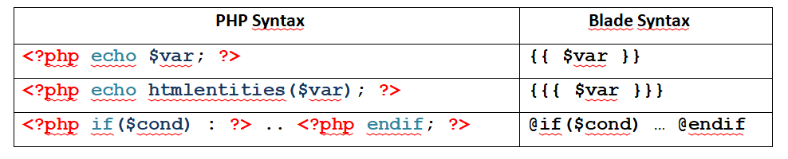
Blade juga mendukung penuh proses looping dan kondisi-logika PHP seperti **@for**, **@foreach**,**@while** , **@if** dan **@elseif**. Supaya tidak bingung dalam menuliskan sintak berikut akan saya contohkan menulis sintak php biasa dengan sintak blade.

## echo variabel

```php
/* script php */
<?php echo "Halo ini cara lama"; ?>

/* script blade template */
{{ "Halo ini cara lama" }}
```

## echo variabel dengan nilai default

```php
/* script php */
<?php echo isset($name) ? name : 'guest'; ?>

/* script blade template */
{{ $name or 'guest' }}
```

## kondisi percabangan

```php
/* script php */
<?php
if($status == 0){
	echo "Proses Gagal";
}elseif($status == 1){
	echo "Proses Berhasil";
}else{
	echo "Tidak diketahui";
}

/* script blade template */
@if($status == 0)
	{{ "Proses Gagal" }}
@elseif($status == 1)
	{{ "Proses Berhasil" }}
@else
	{{ "Tidak diketahui" }}
@endif

/* kebalikan dari if, kondisi tidak memenuhi syarat yang ada */
@unless
	{{ "Anda tidak berhak mengakses halaman ini" }}
@endunless
```

## Looping atau Iterasi

```php
/* script php */

// for statement
<?php
	for($i = 1; $i < 10; $i++){
	 echo $i;
	}
?>

// while statement
<?php
	while($i < 10){
	 echo $i++;
	}
?>

// foreach statement
<?php
	foreach($arr as $value){
		$value = $value + 1;
		echo $value;
	}
?>

/* script blade template */

// for statement
@for($i = 1; $i < 10; $i++)
	{{ $i }}
@endfor

// while statement
@while($i < 10)
	{{ $i++ }}
@endwhile

// foreach statement
@foreach($arr as $value)
	{{ $value = $value + 1 }}
	{{ $value }}
@endforeach
```

## include sub-view

```php
/* script php */
include 'folder/subview';

/* script blade template */
@include('folder.subview')
```

## Penggunaan yield

Penggunaan "yield" dalam Blade Template Engine Laravel merupakan cara yang efektif untuk mengoptimalkan struktur layout dalam pengembangan web dengan kerangka kerja Laravel. "Yield" digunakan untuk mengelola konten yang dinamis dalam berbagai bagian template tanpa harus mengulangi kode yang sama di setiap halaman. Mari kita lihat mengapa penggunaan "yield" ini sangat berguna.

**Contoh penggunaan yield**

```html
<!DOCTYPE html>
<html>
  <head>
    <title>@yield('title')</title>
  </head>
  <body>
    <main>@yield('content')</main>
  </body>
</html>
```

buat halaman spesifik yaitu home dan about pada view resources laravel

**`resources/views/home.blade.php`**

```php
@extends('layout')
@section('title', 'Halaman Utama')
@section('content')
	<h1>Selamat datang di halaman utama!</h1>
@endsection
```

**`resources/views/about.blade.php`**

```php
@extends('layout')
@section('title', 'Halaman Tentang Kami')
@section('content')
	<h1>Tentang Kami</h1>
@endsection
```

## Latihan Memakai Template Admin Dashboard

1. Pilih Template Admin Dashboard
   Cari dan pilih template admin dashboard yang sesuai dengan kebutuhan Anda. Ada banyak template yang tersedia secara gratis atau berbayar di internet, seperti AdminLTE, Bootstrap Admin Themes, dan lainnya.disini saya memakai template admin windmill
   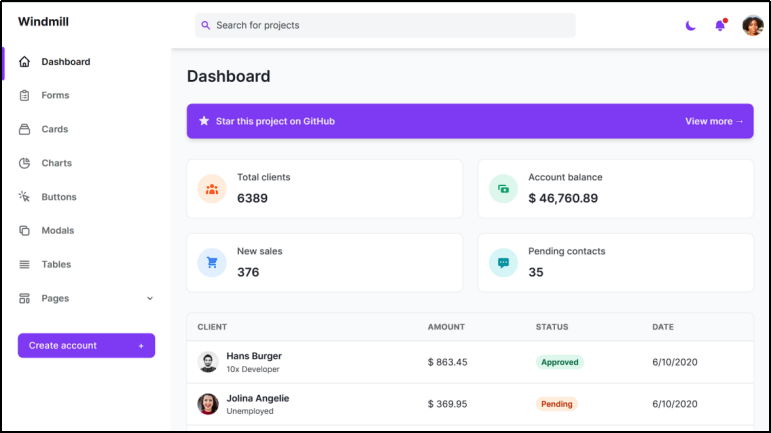
2. Integrasi Template ke Laravel
3. Membuat Bagian Blade untuk Navbar, Sidebar, Header, Body, dan Footer
   Masuk ke folder **resources/views** kemudian buat terlebih dahulu file blade untuk adminnya dan isi file adminnya dari template sudah kita pilih
   Contoh : **admin.blade.php**
   Lalu Sisipkan file html yang sudah kita pilh ke **admin.blade.php**
   Kemudian cari komponen-komponen yang ingin dipisah
   Dari Navbar,Sidebar,Header Dan Footer Buat Masing Masing File Untuk Komponen-Komponen Tertentu
   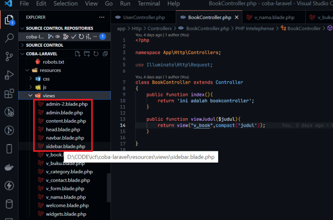
   Setelah itu, buatlah file yang ingin di jadikan sebagai bodynya.
   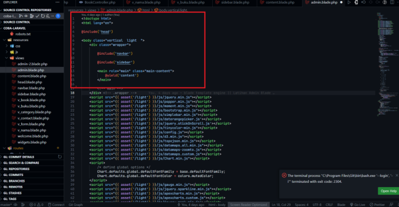
   Kemudian Jika Template Admin Anda Masih Belum Sepenuhnya Berfungsi Mungkin Itu Dikarenakan File File Yang Dibutuhkan Belum Terpanggil Seperti Javascript,Css,Gambar Dll.
   Disini Kita Akan Menggunakan Fungsi **Asset**.Penggunaan umum dari asset adalah untuk membangun URL yang benar ke aset yang berada di dalam direktori "public" di dalam proyek Laravel Anda. Alasan penggunaan direktori "public" adalah karena konten di dalam direktori ini dapat diakses langsung melalui URL, menjadikannya tempat yang tepat untuk menyimpan aset-aset publik.
   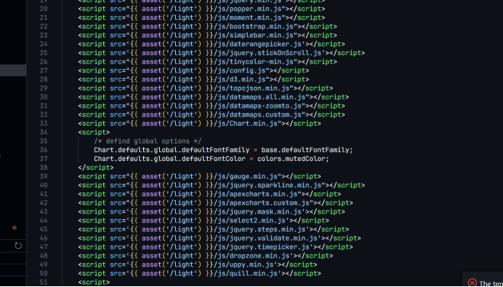

4. Membuat Halaman Konten Spesifik
   Dalam folder "resources/view", buat halaman-halaman blade yang akan mengisi bagian konten dari template.
   Misalnya dalam "dashboard.blade.php".
   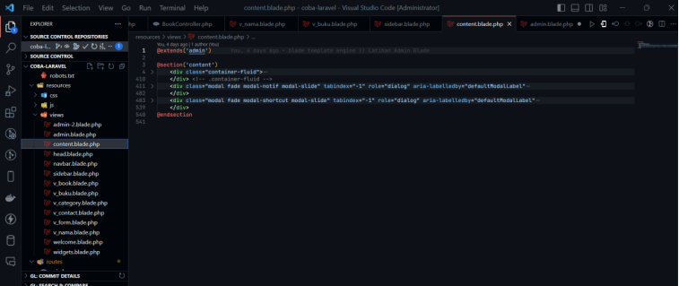
5. Route dan Tampilan Konten
   Tentukan rute di dalam file "web.php" yang akan menampilkan halaman konten.

   **routes/web.php**

```php
Route::get('/dashboard', function(){
	return view('dashboard');
});
```

6. Uji Tampilan
   Jalankan server Laravel Anda dan buka URL yang sesuai dengan rute yang Anda tetapkan (misalnya, '/dashboard').

# Schema Builder Dasar

## Konfigurasi Koneksi Database

Salah satu bagian penting dari konfigurasi aplikasi Laravel adalah pengaturan koneksi ke database. Laravel menyediakan dukungan untuk berbagai database seperti MySQL, PostgreSQL, SQLite, dan SQL Server. Proses konfigurasi ini melibatkan pengaturan informasi koneksi database di file environment (`.env`) dan file konfigurasi (`config/database.php`).

File `.env` digunakan untuk menyimpan konfigurasi lingkungan aplikasi, termasuk detail koneksi database.

1. Buka file `.env` di root direktori proyek Laravel Anda.
2. Cari bagian konfigurasi database, yang biasanya terlihat seperti ini:
   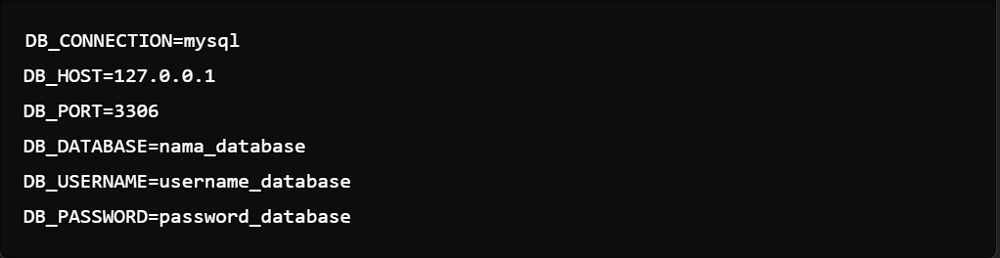
3. Ganti `nama_database`, `username_database`, dan `password_database` dengan informasi database Anda.

Setelah konfigurasi dilakukan, Anda dapat menguji koneksi ke database dengan menjalankan migrasi. dengan menjalankan perintah berikut.

```bash
php artisan migrate
```

## Membuat Tabel

Buka file routes.php dan buat route baru untuk membuat sebuah tabel.

**`routes/web.php`**

```php
Route::get('users', function(){
 Schema::create('users', function($table){
	 $table->increments('id');
	 $table->string('username', 100);
	 $table->string('email', 100);
	 $table->string('password', 60);
	 $table->timestamps;
 });
 return "table users telah dibuat";
});
```

Schema::create mempunyai dua parameter. Parameter pertama, yaitu untuk mendefinisikan nama tabel yang akan dibuat sedangkan parameter kedua yaitu untuk mendefinisikan struktur tabel dari tabel user.

Untuk mengeksekusi kode diatas kemudian buka browser dan ketikan URL dibawah ini
http://localhost:8000/users
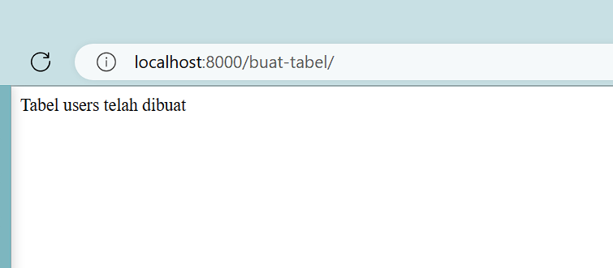
masuk ke database mysql, pilih database yang telah di buat, untuk mengecek apakah tabel telah dibuat.
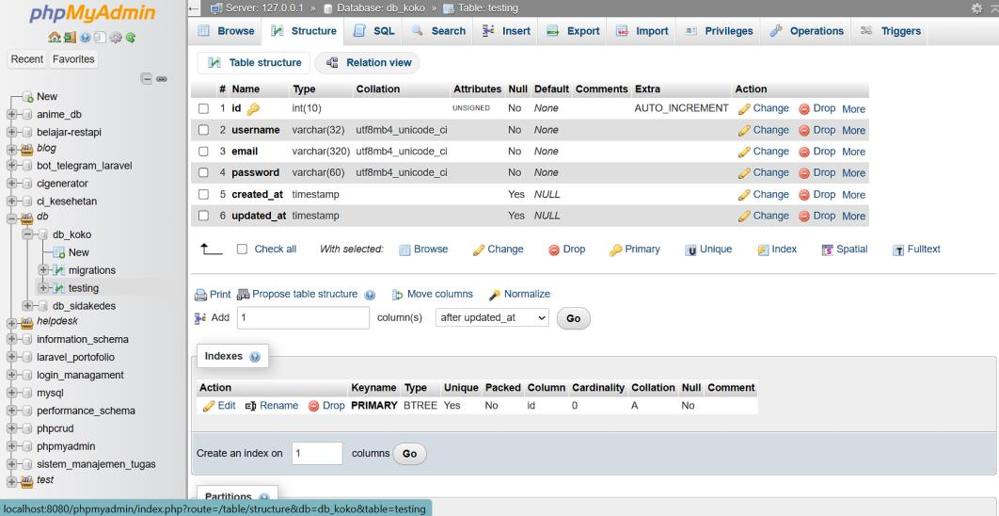
Tabel users telah dibuat di mysql

## Menambah, Rename dan Menghapus Kolom

Kadang-kadang di tengah proses development suatu aplikasi, adakalanya kita ingin menambahkan, menghapus atau bahkan mengganti nama dari suatu kolom. Berikut adalah sintak untuk manipulasi kolom.

**Tambah Kolom**

```php
Schema::table('users', function($table){
	$table->text('alamat');
});
```

**Rename Kolom**

```php
Schema::table('users', function($table){
	$table->renameColumn('alamat', 'alamatKirim');
});
```

**Menghapus Kolom**

```php
Schema::table('users', function($table){
	$table->dropColumn(['alamat','no_telp']);
});
```

## Menambahkan Index dan Foreign Key

Hal ini sangat berguna jika ada tabel yang berelasi dengan tabel lain dengan cara menambahkan foreign key atau menambahkan hal yang unik untuk kolom dari suatu tabel.

**Menambahkan index pada kolom**
**Menambahkan Foreign Key**

## Tipe Kolom

Dari tabel user yang telah kita buat diatas, ada tipe data increments , string dan timestamps merupakan tipe data yang nantinya akan dikonversikan ke tipe data yang ada dalam database mysql.

- **Increments**
  tipe ini akan memberikan nilai integer dengan nilai yang bertambah secara otomatis (increments)

```php
$table->increments('id');
```

- **bigIncrements**
  jika dirasa tipe increments tidak cukup untuk kamu. Bisa menggunakan method bigIncrements() yang akan membuat tipe data big integer.

```php
$table->bigIncrements('id');
```

- **string**
  method ini digunakan untuk menghasilkan tipe data varchar di mysql. Parameter pertama untuk memberi nama kolom / field sedangkan kolom kedua untuk memberi rentang nilai yang diberikan untuk kolom tersebut.

```php
$table->string('username', 32);
```

- **text**
  method text ini digunakan untuk menyimpan data teks yang berukuran besar seperti menyimpan artikel, berita ataupun postingan dari blog.

```php
$table->text('post');
```

- **integer**
  biasanya digunakan untuk tipe data yang berupa bilangan.

```php
$table->integer(‘age',3);
```

- **float**
  float digunakan untuk menyimpan bilangan pecahan atau desimal.

```php
$table->float(‘size');
```

- **boolean**
  tipe ini hanya mempunyai nilai true atau false.

```php
$table->boolean(‘isSmart’);
```

- **date**
  sesuai dengan namanya, tipe ini digunakan untuk meyimpan tanggal / date

```php
$table->date(‘departure’);
```

- **timestamps**
  method ini digunakan utuk meyimpan data tanggal dan waktu dalam format TIMESTAMP. Pada tabel user diatas, kolom timestamps akan menghasilkan dua kolom di tabel users mysql yaitu created_at dan updated_at.

```php
$table->timestamps();
```

# Migration

Kita membuat strutkur tabel, relasi dan lain-lainnya biasanya langsung dari mysql langsung atau menulis sintak SQL dan mendeskripkan tabel beserta kolom apa saja yang dibutuhkan, tapi apa yang akan terjadi jika kita secara tidak sengaja menghapus database tersebut ? apa yang akan terjadi jika kamu belajar sebagai team ? mungkin kamu akan memberikan SQL dump ke masingmasing anggota untuk menjaga database agar selaras. Dari permasalahan dasar seperti itulah fungsi migrations sangat dibutuhkan. Dengan menggunakan fitur migrations ini, kita dapat membuat, memodifikasi dan menghapus suatu tabel atau relasi antar tabel dengan menggunakan kode program dari laravel itu sendiri yaitu migrations. Dengan menggunakan migrations, kamu dan tim dan menjaga kekonsistenan struktur database, tabel-tabel beserta kolomnya. Atau jika masih bingung dari penjelasan diatas, kita akan langsung coba mempraktekannya.

## Membuat Migrations

Pertama, kita akan membuat tabel post dengan menggunakan migrations. Masuk ke Command Promt windows, kemudian arahkan ke direktori laravel projek. Untuk membuat file migrations gunakan perintah berikut :

```bash
php artisan make:migration <nama_file_migrations>
```

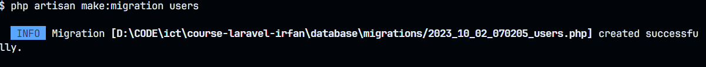
Jika hasilnya sama dengan gambar diatas, kemudian kita cek pada direktori app/database/migrations disini ada file migrations php dengan nama 2014_11_13_043950_create_table_users.php.nama awalnya bisa berbeda-beda tapi nama akhirnya past sama. Dan apabila kita buka, akan menghasilkan kode php sebagai berikut :

**`app/database/migration/2023_10_02_070205_users.php`**

```php
<?php

use Illuminate\Database\Migrations\Migration;
use Illuminate\Database\Schema\Blueprint;
use Illuminate\Support\Facades\Schema;

return new class extends Migration {
    public function up(): void {
        Schema::create('users', function (Blueprint $table) {
            $table->id();
            $table->timestamps();
        });
    }

    public function down(): void {
        Schema::dropIfExists('users');
    }
};
```

Disana terdapat method up() dan down(). Dimana method up()digunakan untuk membuat table dan memanipulasi kolom dari tabel sedangkan method down() biasanya digunakan untuk menghapus tabel atau kolom. Pada method up() dan down()kemudian kita definisikan tabel users beserta kolom nya .

**`app/database/migration/2023_10_02_070205_users.php`**

```php
 Schema::create('users', function (Blueprint $table) {
            $table->increments('id');
            $table->string('nama', 128);
            $table->string('email');
            $table->string('password', 60);
            $table->timestamps();
});
```

## Menjalankan Migrations

Setelah itu masuk ke command prompt yang tadi, kemudian kita akan menjalankan file migration diatas dengan sintak sebagai berikut, jika ada confirmasi install, ketik (y) kemudian Enter :

```bash
php artisan migrate
```

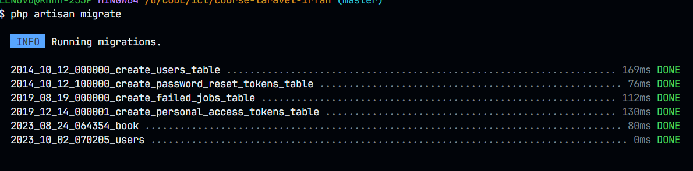
File tersebut sudah berhasil, kemudian masuk ke database mysql untuk mengeceknya
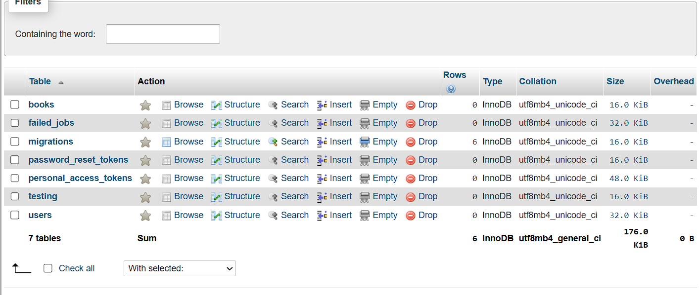Diatas, pada database `db_laravel-11` terdapat dua tabel yaitu tabel migrations dan users. Karena kita menggunakan fitur migrations. Maka otomatis laravel akan membuat tabel migrations yang isinya tentang tabel-tabel yang sudah dimigrasi ke MySQL.

## Rolling Migrations

Seperti yang telah kita ketahui, migrations digunakan untuk kepentingan struktur tabel atau relasi. Tapi kita asumsikan, kita sedang dalam suatu kondisi yang mengharuskan kita mengatur ulang tabel-tabel yang telah kita buat. Dari situ, kita membutuhkan untuk me-rollback perubahan dari tim yang sudah dibuat. Maka kita dapat menggunakan perintah rollback

```bash
php artisan migrate:rollback
```

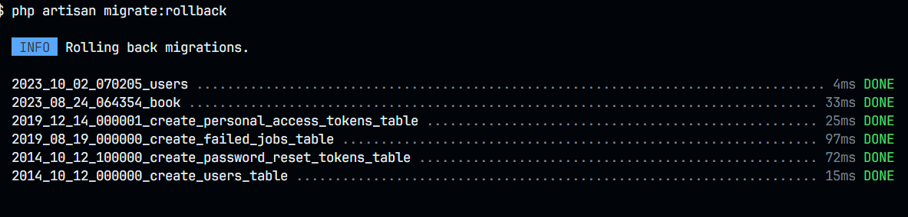
Jika kita mengecek didatabase db_laravel, maka tabel yang suda dibuat menggunakan migrasi akan dibalikan kembali pada saat kita terakhir kali menggunakan perintah migrate.Atau jika kita ingin me-rollback semua tabel migrasi, maka gunakan perintah reset.

```bash
php artisan migrate:reset
```

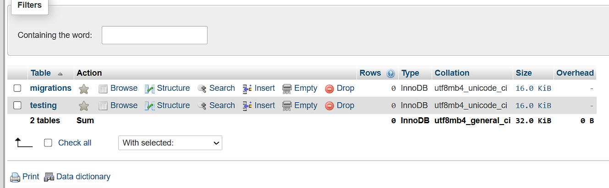

# Seeding

Selain fitur migrations yang dapat membuat strutur tabel dan relasi menggunakan kode program, kita juga dapat menggunakan fitur seeding untuk memasukan data ke tabel tersebut. Seed adalah segala sesuatu yang harus dimuat dalam sebuah aplikasi untuk memastikan aplikasi dapat berjala dengan baik. Hal ini biasanya dianggap sebagai tahap untuk pengujian sistem dan demo. Sebagian besar aplikasi membutuhkan data referensi untuk dimuat guna untuk memastikan kesuksesan proses pengembangan, testing maupun produksi. Untuk mempermudah pemahaman tentang seeding maka akan kita praktikan langsung. Sebelumnya file migrasi yang telah dibuat di bab sebelumnya, kita migrasikan kembali ke database untuk menghasilkan tabel users.

## Membuat Seeding

Untuk membuat seeder di laravel, laravel mempunyai command artisan untuk membuat seeder yaitu:

```bash
php artisan make:seeder UserSeeder
```

Kemudian buatlah seedingnya pada direktori seeders

**`Database/seeders/UserSeeder.php`**

```php
<?php
class UserSeeder extends Seeder {
    public function run(): void
    {
        User::create([
	       'nama' => 'Admin',
	       'email' => 'admin@gmail.com',
	       'password' => Hash::make('rahasia123')
        ]);
    }
}
```

Pada kode diatas ada kode Hash::make('admin123'), kode tersebut untuk mengenkripsi password (rahasia123). Hasil enkripsi nya bisa kita lihat didepan pada saat file seeder sudah dieksekusi. Sesudah kita membuat kelas UsersSeeder.php, supaya laravel mengenali file seeder yang sudah dibuat kemudian kita daftarkan ke kelas DatabaseSeeder.php yang berada dalam satu direktori dengan kelas tersebut yaitu app/database/seeders.

**`database/seeders/DatabaseSeeder.php`**

```php
<?php

class DatabaseSeeder extends Seeder {
    public function run(): void
    {
        $this->call([
            UserSeeder::class
        ]);
    }
}
```

## Menjalankan Seeding

Untuk menjalankan file seeder, masih di command prompt gunakan perintah berikut, jika ada konfirmasi untuk melakukan seeding ketik (y) lalu tekan Enter.

```bash
php artisan db:seed
```

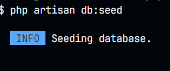
